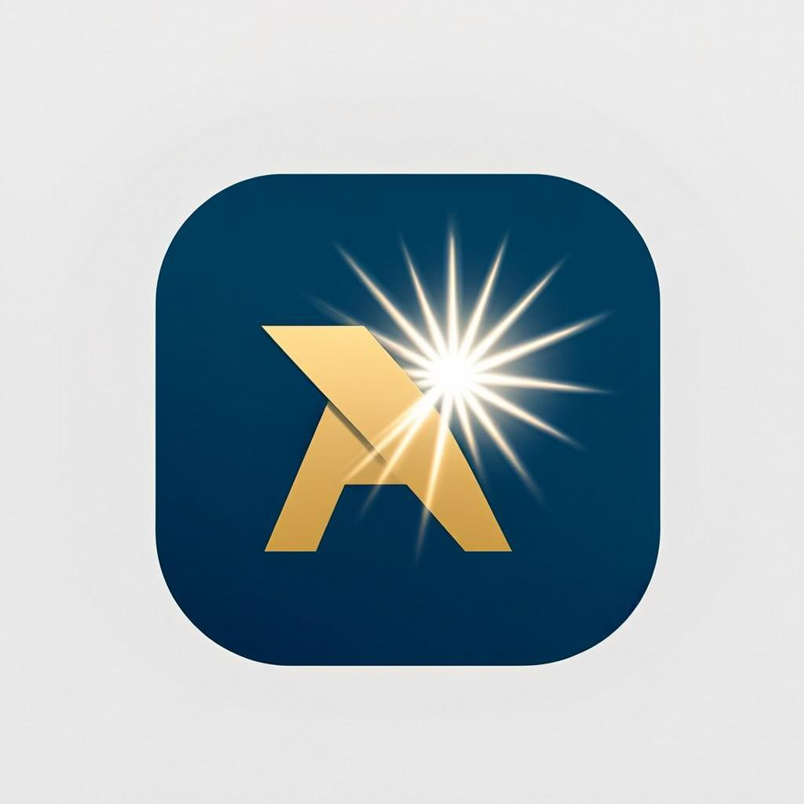

# PlayBeat Digital

A premium, production-ready digital marketplace built with Next.js 16 — featuring a storefront, admin dashboard, Lemon Squeezy payments, multi-currency support (PKR / USD), and real product imagery.



## ✨ Features

### Storefront
- **Home** — hero slider, featured/trending/best-seller/new-arrival rails, categories grid, flash deals with live countdown, customer reviews, newsletter capture
- **Product detail** — real cover images, gallery, variants, license keys, tabbed description/specs/reviews/support, related products, review submission
- **Shop** — sidebar filters (category + flag), search, sort, mobile filter sheet
- **Cart & Wishlist** — persisted via Zustand/localStorage, coupon validation
- **Checkout** — Lemon Squeezy hosted checkout (live) with demo fallback, 4 payment methods (Card / Apple Pay / Google Pay / PayPal), order success screen with license keys + downloads

### Admin Dashboard
- **Dashboard** — KPI cards, revenue area chart, order-status donut, weekly sales bar, customer growth line, top products, recent orders
- **Analytics** — daily sales, traffic sources radial, monthly revenue, revenue by country, top products by revenue
- **Management tables** — Products, Orders (refund/invoice/resend actions), Customers (roles, points, referrals), Coupons (usage bars), Support tickets
- **Settings** — store config, role-based access control matrix (8 roles × 9 permissions), security toggles

### Payments (Lemon Squeezy)
- Official `@lemonsqueezy/lemonsqueezy.js` SDK integration
- Hosted checkout creation (`/api/checkout`)
- Webhook receiver with HMAC-SHA256 signature verification (`/api/lemon/webhook`)
- API key validation & status endpoint (`/api/lemon/status`)
- Order creation on `order_created`, refunds on `order_refunded`

### Multi-currency
- PKR (default) and USD via a currency switcher in the header
- Live conversion (1 USD = 285 PKR, configurable in `src/lib/format.ts`)
- Orders record the display currency; base amounts stay USD for Lemon Squeezy / accounting

## 🛠 Tech Stack

- **Framework**: Next.js 16 (App Router) + TypeScript 5
- **Styling**: Tailwind CSS 4 + shadcn/ui (New York) + Framer Motion
- **Database**: Prisma ORM on PostgreSQL (Neon)
- **State**: Zustand (client) + TanStack Query (server)
- **Charts**: Recharts
- **Payments**: Lemon Squeezy (`@lemonsqueezy/lemonsqueezy.js`)
- **Theme**: next-themes (light/dark)
- **Icons**: Lucide

## 🚀 Getting Started

### Prerequisites
- Node.js 18+ / Bun
- A PostgreSQL database (e.g. [Neon](https://neon.tech))
- A [Lemon Squeezy](https://lemonsqueezy.com) account (optional — runs in demo mode without it)

### Installation

```bash
# Install dependencies
bun install

# Copy the env template and fill in your values
cp .env.example .env
#  - DATABASE_URL: your PostgreSQL connection string
#  - LEMON_API_KEY: your Lemon Squeezy API key (JWT)
#  - LEMON_STORE_ID: your Lemon Squeezy store ID (numeric)
#  - LEMON_DEFAULT_VARIANT_ID: a variant ID to enable live checkouts
#  - LEMON_WEBHOOK_SECRET: webhook signing secret

# Push the database schema & seed sample data
bun run db:push
bun run seed

# Start the dev server
bun run dev
```

Open [http://localhost:3000](http://localhost:3000).

### Available Scripts

| Script | Description |
|--------|-------------|
| `bun run dev` | Start the dev server (port 3000) |
| `bun run lint` | Run ESLint |
| `bun run db:push` | Push Prisma schema to the database |
| `bun run db:generate` | Regenerate Prisma Client |
| `bun run seed` | Seed sample data (25 products, orders, coupons, etc.) |

## 📁 Project Structure

```
prisma/
  schema.prisma          # Database schema (PostgreSQL)
  seed.ts                # Sample data seeder
scripts/
  fetch-images.ts        # Fetches real product cover images via image-search
  product-images.json    # Cached image URLs
src/
  app/
    api/                 # REST API routes
      products/          # Product listing + detail
      categories/        # Category listing
      reviews/           # Review submission
      newsletter/        # Newsletter signup
      orders/            # Order creation (demo checkout)
      checkout/          # Lemon Squeezy hosted checkout
      coupons/validate/  # Coupon validation
      lemon/             # Lemon Squeezy webhook + status
      admin/             # Admin stats/orders/products/customers/coupons/tickets
    layout.tsx           # Root layout (theme provider, SEO, toaster)
    page.tsx             # Single-page app with view router
    globals.css          # Theme (navy/silver/grey/yellow) + glassmorphism
  components/
    ui/                  # shadcn/ui primitives
    sections/            # Home page sections (hero, rails, flash deals, etc.)
    shop/                # Storefront views (home, shop, product, wishlist, checkout)
    admin/               # Admin shell, dashboard, tables, analytics
    product-cover.tsx    # Real-image cover with gradient fallback
    navbar.tsx, footer.tsx, cart-drawer.tsx, currency-switcher.tsx
  lib/
    db.ts                # Prisma client
    lemon.ts             # Lemon Squeezy SDK wrapper
    format.ts            # Currency (PKR/USD) + date helpers
    hooks.ts             # TanStack Query hooks
    use-currency.ts      # Currency hook
    types.ts, serialize.ts, utils.ts
  store/
    use-store.ts         # Zustand store (cart, wishlist, currency, nav)
public/
  logo.png, favicon.svg, apple-touch-icon.png
```

## 🔐 Environment Variables

See [`.env.example`](.env.example) for the full list. Key variables:

| Variable | Description |
|----------|-------------|
| `DATABASE_URL` | PostgreSQL connection string |
| `LEMON_API_KEY` | Lemon Squeezy API key (JWT) |
| `LEMON_STORE_ID` | Lemon Squeezy store ID (numeric) |
| `LEMON_DEFAULT_VARIANT_ID` | Variant ID for live checkouts (empty = demo mode) |
| `LEMON_WEBHOOK_SECRET` | Webhook signing secret |
| `LEMON_DEMO_MODE` | `true` to force demo checkout |

## 🎨 Theme

Premium palette inspired by Apple, Stripe, Linear, Vercel, and Arc:
- **Navy Blue** (primary) · **Silver / Grey** (neutrals) · **Yellow** (accent)
- Glassmorphism, smooth Framer Motion animations, light & dark mode, mobile-first responsive

## 📝 License

MIT — built as a demonstration of a production-grade digital marketplace.
